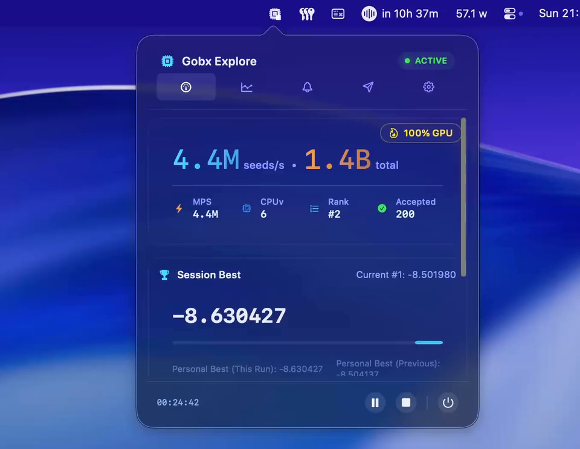

# gobx

**gobx** is a high-performance, native explorer and scorer for the [Gallery of Babel](https://www.echohive.ai/gallery-of-babel/).

It is a native Swift application built for Apple Silicon, using a dual-backend architecture to maximize throughput while maintaining scoring precision. It achieves state-of-the-art search speeds by using a custom fused Metal compute kernel to approximate image statistics without performing a full FFT on the GPU.

## Preview

[](assets/menubar-intro.mp4)

## Features

*   **Hybrid Search Architecture**
    *   **GPU (Metal):** Uses a fused "Pyramid Proxy" kernel (`MetalPyramidScorer`) to estimate variance and spectral properties at multi-million seeds/s on M-series hardware.
    *   **CPU (Accelerate):** Uses vDSP/LinearAlgebra for exact verification of promising candidates found by the GPU.
*   **Adaptive Tuning**
    *   **Batch & Inflight:** Automatically adjusts batch sizes and command buffer saturation to maximize GPU utilization.
    *   **Dynamic Margins/Shift:** Continuously tunes the GPU/CPU scoring margin to balance false positives vs false negatives.
*   **Power Management**
    *   **GPU Profiles:** Configurable thermal profiles (`--gpu-profile`) to balance throughput against system heat and power usage (e.g., "dabbling" for light use, "heater" for max performance).
*   **Resilience**
    *   **Memory Guards:** Monitors `phys_footprint` and stops before hitting macOS memory limits (Jetsam).
    *   **State Management:** Journaled progress tracking allows pausing and resuming without re-scanning seeds.
*   **Advanced Live Dashboard**
    *   **Interactive TUI:** A multi-page terminal interface (switch between Dashboard, Stats, Events, and Submissions).
    *   **Visualizations:** Sparklines for throughput, history charts for scores/rates, and detailed system metrics (GPU Memory/Util, RSS).
*   **Automated Submission:** Automatically submits qualifying seeds to the Gallery of Babel API with retry logic and rate-limit handling.
*   **Optional Stats:** Opt-in, anonymized performance metrics.

## Performance

| Date | Hardware | Device ID | Backend | Throughput | Power | Efficiency |
| :--- | :--- | :--- | :--- | :--- | :--- | :--- |
| 2025-12-26 | **MacBook Pro M4 Pro (24GB)** | `Mac16,8` | Metal (GPU) | **4,779,931 seeds/s** | ~46W | **374.1M seeds/Wh** |
| n/a | **MacBook Pro M4 Pro (24GB)** | `Mac16,8` | Metal (GPU) | **2.04M seeds/s** | ~40W | **183.4M seeds/Wh** |

*Efficiency calculated as (Seeds per Second * 3600) / Watts. Throughput depends on verification rate and adaptive margin/shift.*

> **Note:** Please open a PR to add your hardware and findings.

## Results

This approach reached the #1 spot on the Gallery of Babel leaderboard.

## Requirements

*   **OS:** macOS 14.0+ (Sonoma or Sequoia).
*   **Hardware:** Apple Silicon (M1/M2/M3/M4/M5) strongly recommended.

## Installation

The easiest way to install **gobx** is to download the pre-built binaries from the [Releases page](https://github.com/davelindo/galleryofbabel/releases).

### 1. Menubar App (GUI)

1.  Download `gobx-menubar-macos-arm64.zip` from the latest release.
2.  Unzip the file.
3.  Drag `Gobx Menubar.app` to your **Applications** folder.

### 2. CLI Tool (Terminal)

1.  Download `gobx-macos-arm64.tar.gz` from the latest release.
2.  Extract the archive:
    ```bash
    tar -xzf gobx-macos-arm64.tar.gz
    ```
3.  Move the binary to your path:
    ```bash
    # Keep the resource bundle alongside the binary.
    sudo mv gobx gobx_GobxCore.bundle /usr/local/bin/
    ```

### macOS Security (Gatekeeper)

Because these builds are not notarized by Apple, you may see an "App is damaged" or "Unidentified developer" warning on first launch.

**To bypass this:**

*   **GUI App:** Control-click (Right-click) the app in Finder, select **Open**, and click **Open** in the confirmation dialog.
*   **CLI Tool:** Run the following command to remove the quarantine attribute:
    ```bash
    xattr -dr com.apple.quarantine /usr/local/bin/gobx
    xattr -dr com.apple.quarantine /usr/local/bin/gobx_GobxCore.bundle
    # OR for the app:
    xattr -dr com.apple.quarantine /Applications/Gobx\ Menubar.app
    ```

---

### Alternative: Build from Source

If you prefer to compile it yourself:

```bash
git clone https://github.com/davelindo/galleryofbabel.git
cd galleryofbabel
make build
# Binary location: .build/release/gobx

# To build the Menubar App:
make bundle-menubar
# App location: dist/Gobx Menubar.app
```

## First Run and Setup

Run the tool in exploration mode. It will detect a missing configuration and launch an interactive wizard to set up your profile and optional telemetry, then automatically train proxy weights and run calibration.

```bash
gobx explore
```

Example setup wizard:
```text
No config found. Run first-time setup now? [Y/n]
Profile id [user_...]:
Display name:
X handle (optional):
Share anonymized performance stats? [y/N]
Training proxy weights...
Running Metal calibration...
```

## Configuration

Configuration is stored in `~/.config/gallery-of-babel/config.json`.

```json
{
  "profile": {
    "id": "user_...",
    "name": "YourName",
    "xProfile": "handle"
  },
  "stats": {
    "enabled": false,
    "url": "https://gobx-stats.davelindon.me/ingest"
  }
}
```

## Usage

### Exploration (Mining)
The primary mode is `explore`. It defaults to using the Metal backend with adaptive batching.

```bash
# Run indefinitely with default settings
gobx explore

# Run for a specific count
gobx explore --count 10000000

# Run with a specific thermal profile
gobx explore --gpu-profile dabbling
```

**GPU Profiles (`--gpu-profile`):**
*   `dabbling`: Low usage, keeps system cool (~20-30% load).
*   `interested`: Moderate usage, balanced.
*   `lets-go`: High usage.
*   `heater`: Unrestricted (Default). Max throughput, high power consumption.

**Common Flags:**
*   `--endless`: Explicitly run forever.
*   `--no-ui`: Disable the dashboard (useful for logging to files).
*   `--report-every <sec>`: Status line cadence in non-UI mode.
*   `--start <seed>`: Start from a specific seed.
*   `--setup`: Rerun the interactive setup.
*   `--no-submit`: Disable submissions (useful for testing or offline runs).

### Interactive Dashboard Controls
When running `gobx explore` in a terminal:
*   `1` `2` `3` `4`: Switch tabs (Dashboard, Stats, Events, Submissions).
*   `Tab` / `Shift+Tab`: Cycle tabs.
*   `?`: Toggle help overlay.
*   **Stats Tab:** Use `Left`/`Right` arrows to pan through history.
*   **Logs Tabs:** Use `Up`/`Down`/`PgUp`/`PgDn` to scroll logs.

### Benchmarking
Measure raw throughput without verification overhead.

```bash
# Sweep common batch sizes
gobx bench-metal
```

### Calibration & Training
The Metal proxy requires calibration to map approximate GPU scores to real CPU scores.
*   `gobx calibrate-metal`: Scans random seeds to determine error margins.
*   `gobx train-proxy`: Retrains the linear weights used by the GPU kernel.

### Verification
Check the exact score of a specific seed using the CPU reference implementation.

```bash
gobx score 123456789
```

### Stats Dashboard

The hosted stats service publishes PNGs generated by the `/stats` dashboard. These visuals reflect **only opt-in** runs.


## Architecture details

### The Scoring Function
The tool evaluates 128x128 monochrome images generated from a 64-bit seed using Mulberry32 RNG. The score is a weighted sum of:
1.  **Alpha:** The slope of the power spectrum (log-log), targeting -3.0.
2.  **Peakiness:** Ratio of max power to geometric mean in the mid-frequency ring.
3.  **Flatness:** Spectral flatness measure.
4.  **Neighbor Correlation:** Pixel-wise spatial coherence.

### The Metal Pyramid Proxy
Calculating a full 2D FFT for every seed is expensive. `gobx` uses a custom Metal kernel (`PyramidProxy.metal`) that:
1.  Generates the noise in registers.
2.  Computes neighbor correlation on the fly.
3.  Performs a 2x2 block reduction (pooling) iteratively to approximate spectral energy at different spatial frequencies.
4.  Estimates the final score using learned linear weights.

Candidates passing the GPU threshold are sent to the CPU for exact scoring.

## Troubleshooting

*   **"No valid Metal calibration found"**: Run `gobx calibrate-metal`.
*   **Jetsam / Out of Memory**: The app attempts to exit before hitting limits, but you can try reducing batch sizes or closing other apps.
*   **Crashes**: A crash reporter prints backtraces on SIGSEGV/SIGBUS. Set `GOBX_NO_CRASH_REPORTER=1` to disable it.
